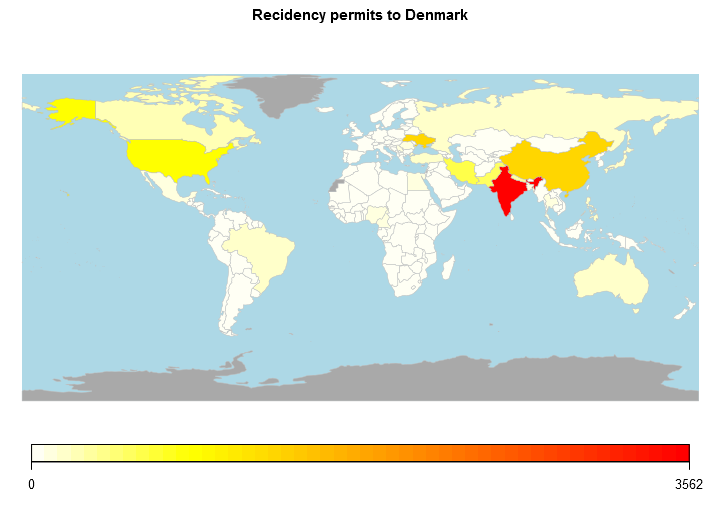

## Forreign immigration to Denmark


In this presentation, we will look at the immigration to Denmark.

This will be done by looking at the number of people receiving residency permits.

Hopefully this can provide some basic information that will be usefull when trying to digest the medias attention to this subject.


### Included in this presentation is :

1. Overview of the number of residency permits per year by barplot in rCharts

2. Mapped number of residency permits by country through rworldmap in shiny

3. Links to the ressources used.

--- 

## Number of residency permits by type


```r
# Using the same csv as for the shiny part later.
# the data is summed by residency permit type. look at shiny part for country details 
resi <- resi %>% group_by(year, type) %>% summarize(permits=sum(permits)) %>%
    select(year, type, permits)
```


<div id = 'chart3e643077750b' class = 'rChart nvd3'></div>
<script type='text/javascript'>
 $(document).ready(function(){
      drawchart3e643077750b()
    });
    function drawchart3e643077750b(){  
      var opts = {
 "dom": "chart3e643077750b",
"width":    800,
"height":    400,
"x": "year",
"y": "permits",
"group": "type",
"type": "multiBarChart",
"id": "chart3e643077750b" 
},
        data = [
 {
 "year": 2006,
"type": "Asylum",
"permits": 1095 
},
{
 "year": 2006,
"type": "EU",
"permits": 12806 
},
{
 "year": 2006,
"type": "Family",
"permits": 3582 
},
{
 "year": 2006,
"type": "Other",
"permits": 616 
},
{
 "year": 2006,
"type": "Study",
"permits": 10976 
},
{
 "year": 2006,
"type": "Work",
"permits": 15396 
},
{
 "year": 2007,
"type": "Asylum",
"permits": 1278 
},
{
 "year": 2007,
"type": "EU",
"permits": 14621 
},
{
 "year": 2007,
"type": "Family",
"permits": 4455 
},
{
 "year": 2007,
"type": "Other",
"permits": 694 
},
{
 "year": 2007,
"type": "Study",
"permits": 13007 
},
{
 "year": 2007,
"type": "Work",
"permits": 21440 
},
{
 "year": 2008,
"type": "Asylum",
"permits": 1453 
},
{
 "year": 2008,
"type": "EU",
"permits": 30544 
},
{
 "year": 2008,
"type": "Family",
"permits": 3749 
},
{
 "year": 2008,
"type": "Other",
"permits": 658 
},
{
 "year": 2008,
"type": "Study",
"permits": 15600 
},
{
 "year": 2008,
"type": "Work",
"permits": 12638 
},
{
 "year": 2009,
"type": "Asylum",
"permits": 1376 
},
{
 "year": 2009,
"type": "EU",
"permits": 24305 
},
{
 "year": 2009,
"type": "Family",
"permits": 4479 
},
{
 "year": 2009,
"type": "Other",
"permits": 732 
},
{
 "year": 2009,
"type": "Study",
"permits": 12988 
},
{
 "year": 2009,
"type": "Work",
"permits": 9168 
},
{
 "year": 2010,
"type": "Asylum",
"permits": 2124 
},
{
 "year": 2010,
"type": "EU",
"permits": 25361 
},
{
 "year": 2010,
"type": "Family",
"permits": 4768 
},
{
 "year": 2010,
"type": "Other",
"permits": 642 
},
{
 "year": 2010,
"type": "Study",
"permits": 11863 
},
{
 "year": 2010,
"type": "Work",
"permits": 10851 
},
{
 "year": 2011,
"type": "Asylum",
"permits": 2249 
},
{
 "year": 2011,
"type": "EU",
"permits": 27395 
},
{
 "year": 2011,
"type": "Family",
"permits": 2902 
},
{
 "year": 2011,
"type": "Other",
"permits": 494 
},
{
 "year": 2011,
"type": "Study",
"permits": 10550 
},
{
 "year": 2011,
"type": "Work",
"permits": 9389 
},
{
 "year": 2012,
"type": "Asylum",
"permits": 2583 
},
{
 "year": 2012,
"type": "EU",
"permits": 30059 
},
{
 "year": 2012,
"type": "Family",
"permits": 3170 
},
{
 "year": 2012,
"type": "Other",
"permits": 494 
},
{
 "year": 2012,
"type": "Study",
"permits": 10652 
},
{
 "year": 2012,
"type": "Work",
"permits": 9024 
},
{
 "year": 2013,
"type": "Asylum",
"permits": 3889 
},
{
 "year": 2013,
"type": "EU",
"permits": 32027 
},
{
 "year": 2013,
"type": "Family",
"permits": 5112 
},
{
 "year": 2013,
"type": "Other",
"permits": 404 
},
{
 "year": 2013,
"type": "Study",
"permits": 11601 
},
{
 "year": 2013,
"type": "Work",
"permits": 11529 
},
{
 "year": 2014,
"type": "Asylum",
"permits": 6104 
},
{
 "year": 2014,
"type": "EU",
"permits": 35415 
},
{
 "year": 2014,
"type": "Family",
"permits": 5727 
},
{
 "year": 2014,
"type": "Other",
"permits": 516 
},
{
 "year": 2014,
"type": "Study",
"permits": 12144 
},
{
 "year": 2014,
"type": "Work",
"permits": 12436 
},
{
 "year": 2015,
"type": "Asylum",
"permits": 10856 
},
{
 "year": 2015,
"type": "EU",
"permits": 37361 
},
{
 "year": 2015,
"type": "Family",
"permits": 11642 
},
{
 "year": 2015,
"type": "Other",
"permits": 491 
},
{
 "year": 2015,
"type": "Study",
"permits": 12646 
},
{
 "year": 2015,
"type": "Work",
"permits": 11688 
} 
]
  
      if(!(opts.type==="pieChart" || opts.type==="sparklinePlus" || opts.type==="bulletChart")) {
        var data = d3.nest()
          .key(function(d){
            //return opts.group === undefined ? 'main' : d[opts.group]
            //instead of main would think a better default is opts.x
            return opts.group === undefined ? opts.y : d[opts.group];
          })
          .entries(data);
      }
      
      if (opts.disabled != undefined){
        data.map(function(d, i){
          d.disabled = opts.disabled[i]
        })
      }
      
      nv.addGraph(function() {
        var chart = nv.models[opts.type]()
          .width(opts.width)
          .height(opts.height)
          
        if (opts.type != "bulletChart"){
          chart
            .x(function(d) { return d[opts.x] })
            .y(function(d) { return d[opts.y] })
        }
          
         
        
          
        

        
        
        
      
       d3.select("#" + opts.id)
        .append('svg')
        .datum(data)
        .transition().duration(500)
        .call(chart);

       nv.utils.windowResize(chart.update);
       return chart;
      });
    };
</script>

---

## Mapping of residency permits by country

Image from the [shiny app](https://khlavus.shinyapps.io/ImmigrationDK/) showing work permits in 2015



---

## Ressources

Data downloaded from [statistikbanken.dk](http://www.statistikbanken.dk/statbank5a/default.asp?w=1280)

Search for statistic VAN66 english version

The data is downloaded as matrix-csv and processed in R

Source code for [processing and shiny](https://github.com/clausgp/ddpshiny)

Source code for [slidify](https://github.com/clausgp/ddpslidify) presentation
